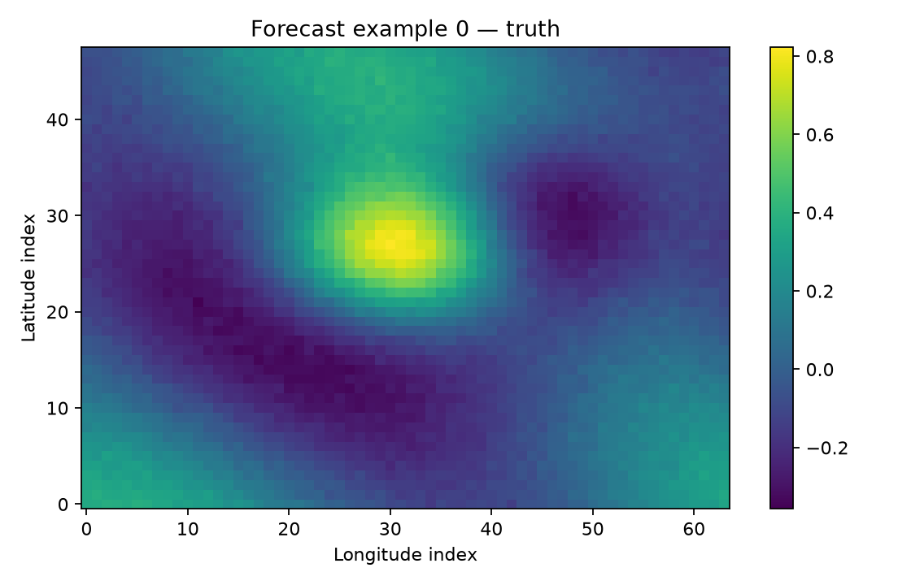
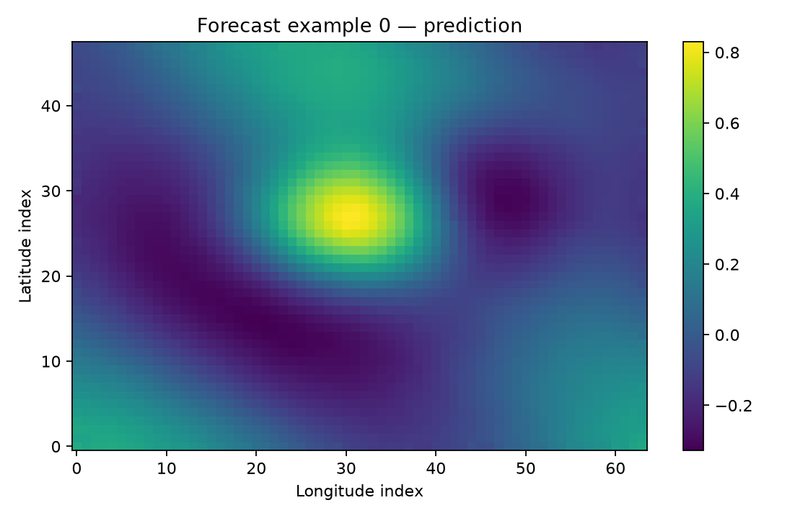
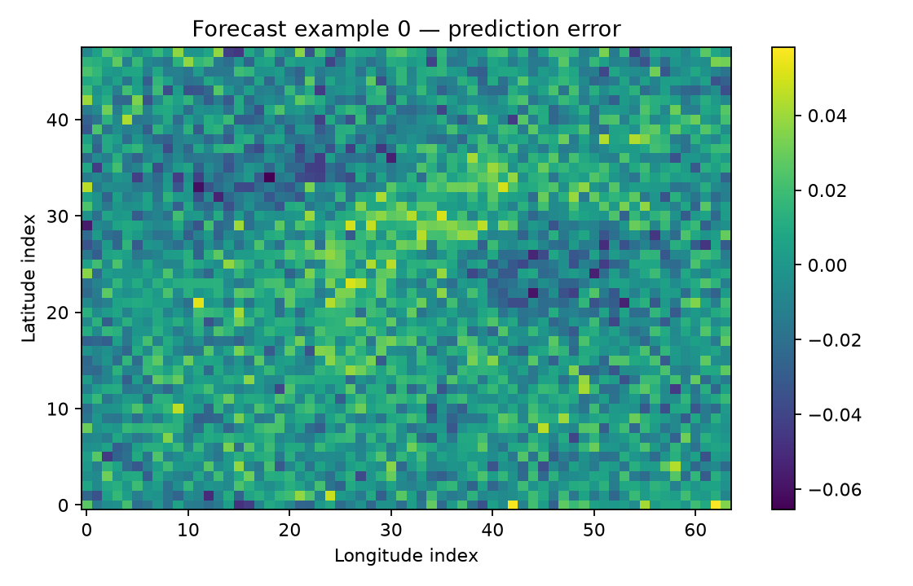

# Baseline CNN evaluation

This report documents the first reproducible Mini-GLONET baseline on the
synthetic ocean dataset defined in `configs/base.yaml`.

## Results

| Method | RMSE |
|---|---:|
| Persistence baseline | 0.034371 |
| Mini-GLONET CNN | 0.016807 |

Mini-GLONET reduces RMSE by **51.1%** relative to the persistence
baseline.

## Reproduction

```powershell
python -m pytest -q
python -m mini_glonet.train --config configs/base.yaml
python -m mini_glonet.evaluate --config configs/base.yaml --checkpoint outputs/best_model.pt
```

The checkpoint is a generated binary artifact and is intentionally not tracked
in Git. It can be recreated by running the training command above.

## Training curve


## Representative forecast

### Ground truth



### Mini-GLONET prediction



### Prediction error



Additional forecast examples are available in the `figures` directory.

## Interpretation

The CNN performs better than persistence on this controlled synthetic dataset.
This validates the data, training, checkpointing and evaluation pipeline.

## Limitation

These metrics are not yet an operational ocean-forecasting result. The current
experiment uses synthetic fields; evaluation on real NetCDF ocean data remains
a future step.
