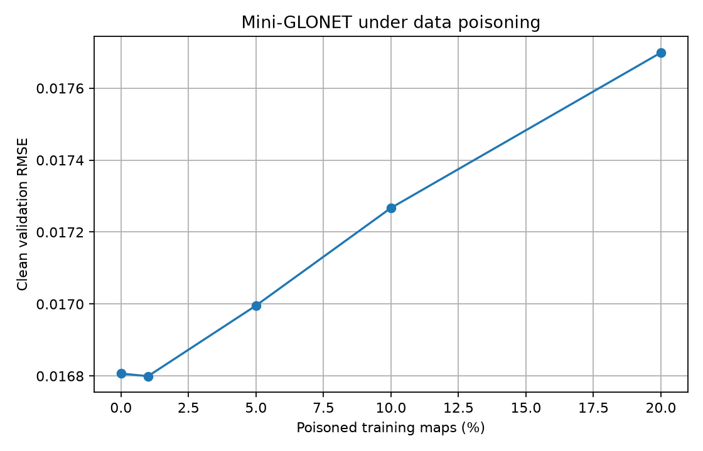

# Data Poisoning robustness experiment

## Objective

Evaluate the sensitivity of Mini-GLONET to controlled corruption of its
training data.

Unlike FGSM, which attacks the input at inference time, this experiment
modifies only a fraction of the training time maps and then trains a new model
from scratch.

## Experimental protocol

- Dataset: synthetic ocean fields
- Model: MiniGlonetCNN
- Training epochs per poison rate: 12
- Validation set: always clean
- Poison rates: 0.0%, 1.0%, 5.0%, 10.0%, 20.0%
- Poison type: zero-mean Gaussian corruption
- Poison strength: 0.50 x clean training-field standard deviation
- Normalization statistics: computed from clean training data and reused for every experiment
- Random seed: 42

## Results

| Poison rate | Poisoned maps | Validation RMSE | Degradation |
|---:|---:|---:|---:|
| 0.0% | 0 | 0.016807 | 0.0% |
| 1.0% | 7 | 0.016799 | -0.0% |
| 5.0% | 36 | 0.016996 | 1.1% |
| 10.0% | 72 | 0.017267 | 2.7% |
| 20.0% | 144 | 0.017699 | 5.3% |



## Interpretation

The 0% experiment is the clean reference. For higher poison rates, a
controlled fraction of training maps is corrupted before training while the
validation data remain unchanged.

An increase in clean-validation RMSE indicates that training-data poisoning
has degraded the learned forecasting model.

## Important limitation

This is a controlled academic experiment on synthetic ocean-like fields.
The current poisoning mechanism models generic corrupted observations; it is
not yet tied to a specific real ocean sensor or operational data pipeline.

## Reproduction

```powershell
python experiments/evaluate_data_poisoning.py `
    --config configs/base.yaml `
    --poison-rates 0 0.01 0.05 0.10 0.20 `
    --poison-strength 0.5
```
