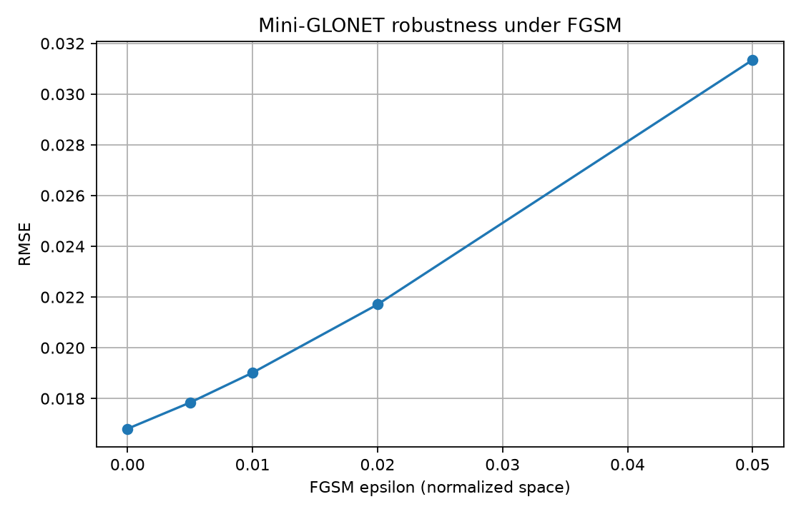

# FGSM robustness experiment

## Objective

Evaluate Mini-GLONET against a controlled white-box FGSM input-manipulation attack.

The attack is:

`x_adv = x + epsilon * sign(dL/dx)`

The model weights are never updated during the attack.

## Setup

- Model: MiniGlonetCNN
- Dataset: synthetic ocean validation split
- History: 4 time steps
- Attack loss: MSE
- Attack: white-box FGSM
- Input clipping: normalized validation min/max
- Epsilon is measured in normalized input space

## Results

| epsilon | RMSE | degradation vs clean |
|---:|---:|---:|
| 0.000 | 0.016807 | 0.0% |
| 0.005 | 0.017839 | 6.1% |
| 0.010 | 0.019015 | 13.1% |
| 0.020 | 0.021706 | 29.2% |
| 0.050 | 0.031346 | 86.5% |

## Interpretation

Epsilon = 0 is the clean baseline. Higher epsilon values create input
perturbations chosen to increase the model loss. The RMSE increase measures
the sensitivity of Mini-GLONET to controlled adversarial input manipulation.

## Limitation

The current experiment uses synthetic normalized ocean fields. Epsilon is not
directly a temperature, salinity, or other physical ocean unit.
